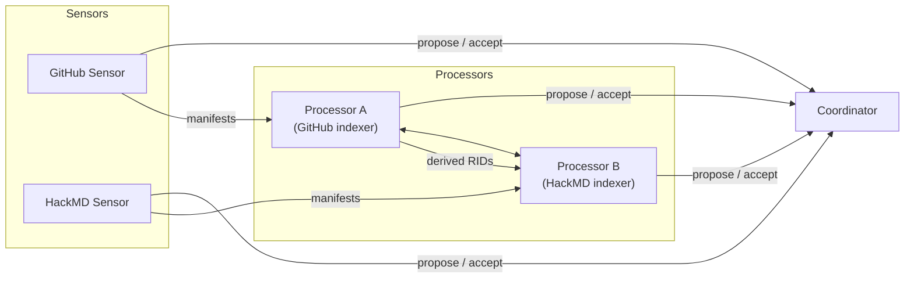

# KOI‑net Demo

_Autonomous Sensor‑Processor Subnet for GitHub & HackMD_

---

## 1 Project Title & Tagline

**KOI‑net Demo – from SaaS events to knowledge objects, fully automatically**

---

## 2 Overview

**KOI‑net** (Core Orchestration Interface) is a lightweight, event‑driven protocol for wiring arbitrarily many **sensors** (ingestion nodes) and **processors** (analysis nodes) into a self‑organising subnet.  
This demo ships five containerised nodes:

| Kind        | Node            | Purpose                                              |
| ----------- | --------------- | ---------------------------------------------------- |
| Coordinator | `coordinator`   | roots the subnet, brokers edge hand‑shakes           |
| Sensor      | `github‑sensor` | emits commit manifests from one or more GitHub repos |
| Sensor      | `hackmd‑sensor` | emits note manifests from a HackMD team              |
| Processor   | `processor‑a`   | indexes GitHub bundles, exposes `/search`            |
| Processor   | `processor‑b`   | indexes HackMD bundles, exposes `/search`            |

The goal is to show an **end‑to‑end autonomous pipeline**: sensors publish manifests, processors resolve the bundles they care about, build local indices, and expose query endpoints – all without manual wiring beyond pointing every container at the Coordinator.

---

## 3 Architecture



### 3.1 Service Topology

| Service         | Port   | Key Routes                                                         |            |
| --------------- | ------ | ------------------------------------------------------------------ | ---------- |
| `coordinator`   | `8080` | `/koi‑net/edges/*`, health `/koi‑net/health`                       |            |
| `github‑sensor` | `8001` | GitHub webhook `/github/webhook`, all KOI paths under `/koi‑net/…` |            |
| `hackmd‑sensor` | `8002` | all KOI paths under `/koi‑net/…`                                   |            |
| `processor‑a`   | `8011` | \`/search?q=\<sha                                                  | keyword>\` |
| `processor‑b`   | `8012` | \`/search?q=\<tag                                                  | title>\`   |

All nodes speak KOI on the same base path so processors can dereference bundles from any peer.

---

## 4 Key Features

- **Autonomous edge negotiation** – every node bootstraps with a single URL (the Coordinator) and self‑forms the rest of the graph.
- **Manifest‑first protocol** – processors download full bundles only when hashes change, keeping bandwidth minimal.
- **Pluggable processors** – add new analytics by dropping in another container that subscribes to existing RIDs.
- **Stateless containers** – all durable artefacts live in named Docker volumes.
- **Language‑agnostic** – only requires HTTP+JSON; the reference implementation is Python 3.12.

---

## 5 Directory Structure

```tree
.
├─ config/             # YAML & .env examples (docker & local flavours)
├─ docker-compose.yml  # five‑service demo stack
├─ nodes/              # each node is a standalone Python package
│  ├─ koi‑net‑coordinator‑node/
│  ├─ koi‑net‑github‑sensor‑node/
│  ├─ koi‑net‑hackmd‑sensor‑node/
│  ├─ koi‑net‑processor‑a‑node/
│  └─ koi‑net‑processor‑b‑node/
└─ rid_types/          # shared RID class re‑exports
```

## 6 Quick Start

### 6.1 Prerequisites

- **Python 3.12**
- **Make**
- **Docker & Docker Compose**
- GitHub & HackMD API tokens

### 6.2 Setup and Run

1.  **Clone repository**

    ```bash
    git clone https://github.com/sayertindall/koi-demo.git koi-demo
    cd koi-demo
    ```

2.  **Create and activate virtual environment**

    ```bash
    make setup
    source .venv/bin/activate
    ```

3.  **Install packages**

    ```bash
    make install
    ```

4.  **Configure environment**

    ```bash
    cp config/docker/global.env.example config/docker/global.env
    ```

    Edit `config/docker/global.env` and set your:

    - `HACKMD_TOKEN`
    - `GITHUB_TOKEN`
    - `GITHUB_WEBHOOK_SECRET`

5.  **Start services**

    ```bash
    make up
    ```

6.  **Verify running containers**

    ```bash
    docker ps
    ```

    You can also check the health of the coordinator:

    ```bash
    curl -s http://localhost:8080/koi-net/health
    ```

---

## 7 Configuration

| Folder          | Use                                  |
| --------------- | ------------------------------------ |
| `config/local`  | opinionated defaults for laptop runs |
| `config/docker` | values baked into the public images  |

Common **environment variables**

| Var                     | Description                                           |
| ----------------------- | ----------------------------------------------------- |
| `GITHUB_TOKEN`          | personal access token for GitHub API rate limits      |
| `HACKMD_TOKEN`          | team API token                                        |
| `GITHUB_WEBHOOK_SECRET` | HMAC secret for `/github/webhook`                     |
| `WEBHOOK_SECRETS`       | additional secrets (comma‑separated)                  |
| `SUBNET_ID`             | identifier for the subnet (defaults to `demo-subnet`) |
| `RID_CACHE_DIR`         | path (inside container) for manifest/bundle cache     |

Every key in the YAML can be overridden by exporting the same‑named env var.

---

## 8 Usage

### 8.1 Health

```
GET /koi-net/health       # all nodes expose this
```

### 8.2 KOI Protocol

| Path                        | Method | Purpose                     |
| --------------------------- | ------ | --------------------------- |
| `/koi‑net/broadcast-events` | POST   | push event(s) to a peer     |
| `/koi‑net/poll-events`      | POST   | long‑poll for queued events |
| `/koi‑net/fetch-rids`       | POST   | discover RIDs by type       |
| `/koi‑net/fetch-manifests`  | POST   | retrieve manifests          |
| `/koi‑net/fetch-bundles`    | POST   | dereference bundles         |

### 8.3 Processor Search APIs

```
# GitHub commit or PR SHA / keyword
GET http://processor-a:8011/search?q=<sha-or-text>

# HackMD title, tag or phrase
GET http://processor-b:8012/search?q=<query>
```

### 8.4 GitHub Webhook

```
POST /github/webhook        # HMAC‑signed if GITHUB_WEBHOOK_SECRET set
```

Payloads are queued as `GithubCommit` bundles for downstream processors.

---

## 9 Development

```bash
# editable installs
cd nodes/koi-net-github-sensor-node
uv pip install -e .[dev]
# lint & test
pytest -q
```

- **Handlers** live in `*_sensor_node/handlers/` or `processor_*_node/handlers/`.
- Each handler registers via `@node.processor.register_handler`.
- Add new RID classes in `rid_types/` and publish to PyPI to share across nodes.

---

## 10 Testing

Unit tests use **pytest** and **httpx.AsyncClient** test clients. Run `pytest -q` from the repo root. Add live‑network integration tests under `tests/integration/`.

---

## 11 Troubleshooting & FAQ

| Symptom                           | Fix                                          |
| --------------------------------- | -------------------------------------------- |
| `curl .../health` returns non‑200 | container not ready – check logs             |
| Processor reports "cache miss"    | ensure sensors are healthy and edge accepted |
| GitHub rate‑limit                 | set `GITHUB_TOKEN` with repo‑scope PAT       |

---

## 12 Contributing

1. Fork & create a feature branch.
2. Add tests.
3. Run `ruff` and `mypy`.
4. Open a PR – every node is an independent Python package, so bump its version in its `pyproject.toml` if public APIs change.

---

## 13 License

All code is released under the **MIT License**. See individual node folders for the full text.

```

```
